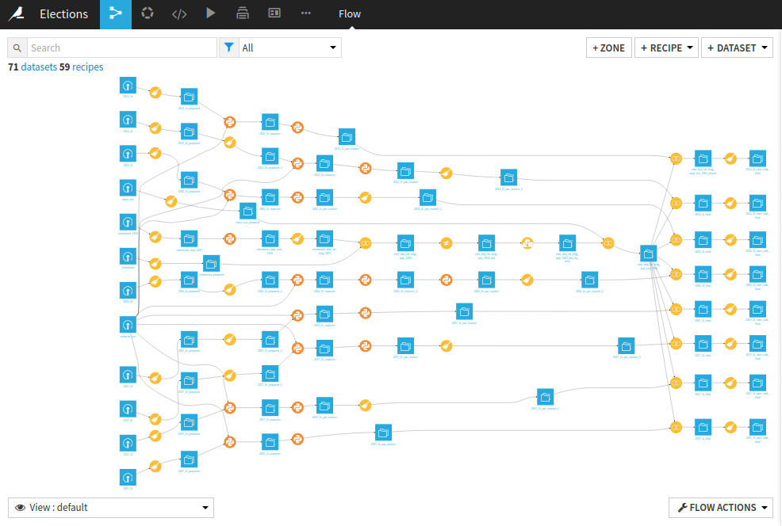
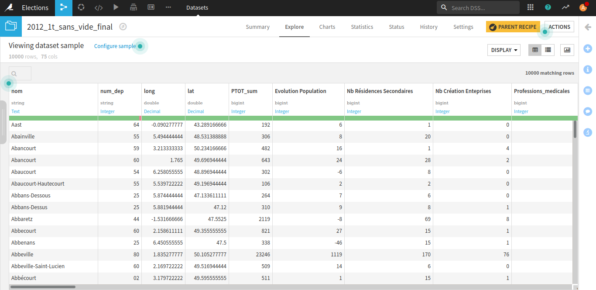
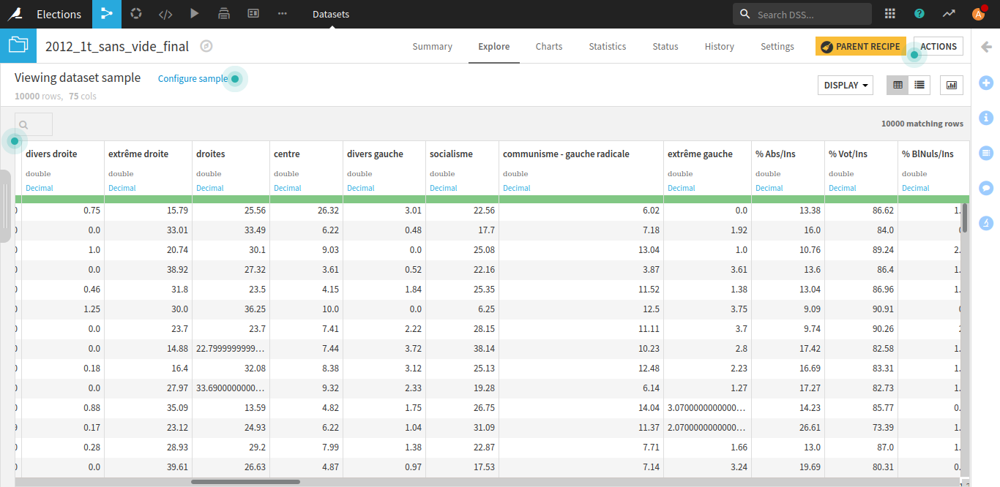

# Présentation

Ce devoir a été réalisé par Morgan G., Pierre T. et Victor M. dans le cadre du cours de M. Poupeau à l'Ecole nationale des chartes (année universitaire 2020-2021). 

L'objectif de cet exercice était est de produire des data visualisations socio-économiques des résultats par commune des élections présidentielles françaises (2002-2017).

Lien vers le projet Dataiku : https://drive.google.com/drive/folders/1L8RwPhJ2gtkk2kugHoXoPRvDu4bnywc9?usp=sharing

# Données

Les données sur les résultats électoraux proviennent de [data.gouv.fr](https://www.data.gouv.fr/fr/posts/les-donnees-des-elections/).

Les données économiques proviennent de l'[INSEE](https://www.data.gouv.fr/fr/datasets/data-insee-sur-les-communes/). Ces données, les plus récentes trouvées, datent de 2016, ce qui représente un biais scientifique dans le cadre du projet. 

Les données géographiques ont été récupérées via le SPARQL Endpoint de Wikidata. Les requetes SPARQL sont documentées dans le dossier **`requetes`**.

Le nuancier politique provient de [Wikipedia](https://fr.wikipedia.org/wiki/%C3%89lection_pr%C3%A9sidentielle_en_France).

# Traitement des données et choix scientifiques

On a fixé comme objectif du *mashup* la production d'un *dataset* par tour, soit deux *datasets* par élection et huit en tout. 

Chaque *dataset* comporte pour chaque commune les données géographiques, économiques et politiques (classées par nuances et par candidat).

Les communes qui peuvent avoir des homonymes en France sont différenciées par leur numéro de département. 

Pour des raisons techniques, on a choisi de supprimer les lignes qui ne passaient pas à 100% aux jointures. Ces lignes qui contiennent au moins une cellule vide peuvent être causées par les écrats dans le temps entre les différentes sources de données (fusions de communes...). Ces lignes peuvent causer des problèmes pour la visualisation. 

On a choisi, pour les données économiques, de ne garder que celles exprimées en pourcentage ainsi que celles qui semblaient les plus intéressantes pour illustrer la vitalité économique d'une commune (par exemple les données liées au tourisme pour les régions concernées). 

Les données ont été nettoyées et agrégées via l'outil [Dataiku DSS](https://www.dataiku.com/) en utilisant principalement des recettes de type "*prepare*", jointure SQL et script Python.

Les scripts Python utilisés pour traiter les données sont documentés dans le dossier **`python`**.

# Captures d'écran

Le *flow* Dataiku.

Les données géographiques et économiques pour le premier tour des élections de 2012.

Les données politiques pour le premier tour des élections de 2012. Les nuances sont calculées en additionnant les résultats de chacun des candidats. 

# Data visualisations